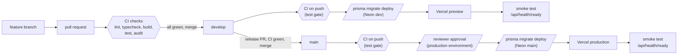

# PFC - Professional Fighting Championship

Next.js 15 front end for Task 2 (Code and Implementation), INSY7315 Work
Integrated Learning.

**Client:** Professional Fighting Championship, Bothasig, Cape Town
**Team:** Seth Oliver (desktop), Ruan Cupido (mobile)

---

## Running it

Requires Node 18.18 or newer.

```bash
npm install
npm run dev
```

Then open <http://localhost:3000>.

```bash
npm run build && npm start   # production build
npm run typecheck            # tsc --noEmit
```

### Demo accounts

| Email | Password | Role | Lands on |
|---|---|---|---|
| `member@pfc.co.za` | `Member123!` | Member | Member dashboard, R900 plan |
| `sofia@pfc.co.za` | `Coach123!` | Coach | Coach dashboard |
| `marcus@pfc.co.za` | `Coach123!` | Coach | Coach dashboard |
| `admin@pfc.co.za` | `Admin123!` | Admin | Admin dashboard |

All three roles use the same `/dashboard` URL; the session's role picks the view.

---

## Structure

```
├── src/
│   ├── app/                     App Router — one folder per route
│   │   ├── layout.tsx           header, footer, fonts, scroll reveal
│   │   ├── page.tsx             home
│   │   ├── globals.css          all styling, mobile-first
│   │   ├── classes/ coaches/ memberships/ timetable/ contact/
│   │   ├── login/ register/ promo/ denied/
│   │   ├── dashboard/           page.tsx picks Member/Coach/Admin view
│   │   ├── error.tsx            runtime error boundary
│   │   └── not-found.tsx        404
│   ├── actions/
│   │   ├── auth.ts              login, register, logout, requireSession
│   │   └── gym.ts               booking, plan changes, contact enquiry
│   ├── components/              header/nav, footer, cards, form fields
│   └── lib/
│       ├── types.ts             domain types and formatting helpers
│       ├── gym-data.ts          seeded content — the database seam
│       ├── users.ts             accounts, scrypt password hashing
│       ├── session.ts           signed cookie sessions
│       └── validation.ts        shared form rules
└── public/images/               16 optimised photos of the client's facility
```

---

## One codebase, both breakpoints

Desktop and mobile are the same components and the same stylesheet. There is no
separate mobile site to keep in sync. `globals.css` is mobile-first: the base
rules are the phone layout, and two media queries add complexity as the viewport
grows.

| Breakpoint | Width | What changes |
|---|---|---|
| Base | 0–767px | Single column. Hamburger nav. Card rows become horizontal snap-scrollers. Stats 2-up. Popular plan first. Footer collapses to accordions. Sticky Join CTA. |
| Tablet | ≥768px | Scrollers become 2-column grids. Stats 3-up. Plans 3-across, popular one back in the middle. Footer opens to 3 columns. |
| Desktop | ≥1024px | Inline nav replaces the hamburger. 3-column grids. Dashboard gains its fixed sidebar. Sticky CTA hidden. |

Test by dragging the window, or Chrome DevTools → `Ctrl+Shift+M`.

---

## Architecture notes

**Server components by default.** Pages render on the server and ship no
JavaScript for their content. Only five components opt into the client, and each
does so for a reason it could not achieve otherwise: the nav overlay (open
state and focus trap), the three forms (`useActionState` for inline errors), the
password toggle, the submit button (`useFormStatus`), and the scroll reveal.

**Server actions instead of API routes.** Forms post directly to functions
marked `"use server"`. Next generates the endpoint and includes an anti-CSRF
origin check automatically, so there is no fetch wrapper and no hand-rolled
token to get wrong.

**Validation runs on the server, always.** `lib/validation.ts` holds the rules;
every action runs them on submission and re-renders the form with per-field
errors. The client components surface those errors instantly through
`useActionState`, but the browser is never trusted, with JavaScript disabled
the form still posts, still validates, and still shows errors.

**The data layer is one seam.** Pages import from `lib/gym-data.ts` and
`lib/users.ts` and never touch storage directly. Part 2 swaps those two modules
for Prisma or Drizzle queries; no page or component changes.

**`server-only` is enforced, not assumed.** `gym-data.ts`, `users.ts` and
`session.ts` import the `server-only` package, so importing one into a client
component fails the build rather than silently shipping password hashes to the
browser.

---

## Security

**Passwords** are hashed with scrypt, deliberately slow and memory-hard, so a
stolen hash list resists offline brute force. Every account gets its own random
salt, so two people choosing the same password still store different hashes.
Comparison is fixed-time (`timingSafeEqual`), and an unknown email still runs
one hash before failing, so response timing cannot reveal which addresses are
registered.

**Sessions** are a cookie signed with HMAC-SHA256. Editing the payload to claim
a different role breaks the signature and the session is rejected, there is a
test for exactly this. The cookie is `httpOnly` (JavaScript cannot read it),
`sameSite=lax` (not sent on cross-site POSTs, which blocks CSRF) and `secure`
outside development.

**`SESSION_SECRET`** must be set in production; the app refuses to start
without it. Copy `.env.example` to `.env.local` and generate one:

```bash
node -e "console.log(require('crypto').randomBytes(48).toString('base64url'))"
```

**Open redirects** are blocked: `returnUrl` is followed only when it is a path
on this site, so a crafted login link cannot bounce a user elsewhere after
signing in.

**Failed logins are deliberately vague** - "Email or password is incorrect"
rather than naming which was wrong, which would confirm that an address exists.


### Request hardening

**XSS (cross-site scripting).** Two layers. React escapes every value it
renders, and the code never uses `dangerouslySetInnerHTML`, so text a user
types is shown as text. Second, `src/middleware.ts` sends a
`Content-Security-Policy` with a fresh nonce on every request:
`script-src 'self' 'nonce-…' 'strict-dynamic'`. A script that someone manages to
inject has no nonce, so the browser refuses to run it; inline event handlers
and `javascript:` URLs are refused for the same reason. `object-src 'none'`,
`base-uri 'self'`, `form-action 'self'` and `frame-ancestors 'none'` close the
other injection routes, and `unsafe-eval` exists in development only. (Checked
in a real browser: an injected inline script and an injected `onerror` handler
are both blocked, and every page loads with no policy violations.) If a new
page ever trips the policy, set `CSP_REPORT_ONLY=1` to log violations instead of
blocking while you fix it.

**Security headers** on every response (`next.config.mjs`): HSTS for two
years, `X-Content-Type-Options: nosniff`, `X-Frame-Options: DENY`,
`Referrer-Policy: strict-origin-when-cross-origin`, and a `Permissions-Policy`
that switches off camera, microphone, geolocation and payment.

**Route gate.** `middleware.ts` (Node.js runtime, no database call) checks the
session cookie's signature before `/dashboard`, `/bookings`, `/admin` and
`/coach` render, and the role for `/admin` and `/coach`. It is defence in depth:
`getSession()`, the pages and the services still make the real decision, using
the database.

**CSRF on the JSON API.** Every POST, PATCH and DELETE route first calls
`assertSameOrigin`: the `Origin` (or `Referer`) must match the host in
`APP_URL`, or the answer is 403. Server actions rely on Next's own origin check.

**Rate limiting** lives in Postgres (`RateLimitBucket`), one atomic
`INSERT … ON CONFLICT DO UPDATE`, so it holds across serverless instances with
no Redis. Keys are SHA-256 hashes, so no email or address is stored in plain
text. Limits: login 5 per 15 min per ip+email and 30 per 15 min per ip (a
successful login clears the ip+email bucket), register 5/h, forgot-password
3/h per ip and per email, reset-password 10/h, contact form 5/h, bookings 30
per 10 min per user, uploads 20/h per user. If the database is down the limiter
fails open for public pages and closed for sign-in and password flows.

**Request bodies.** `readJson` rejects a non-JSON Content-Type (415), a body over
100,000 bytes (413) and invalid JSON (400) before any route logic runs.

**Errors.** `global-error.tsx` and `error.tsx` show a fixed message; the real
error is logged by `src/lib/logger.ts`. No route returns a stack trace, and
`/api/health/ready` answers `{ "status": "unavailable" }` with no detail.

---

## Accessibility

- Semantic landmarks: `header`, `nav`, `main`, `footer`, `article`, `figure`
- Skip-to-content link, visible on keyboard focus
- `:focus-visible` outline in brand red on every interactive element
- The nav overlay is a real modal: `aria-modal`, focus moved in on open, focus trapped on Tab, Escape closes, focus restored, page behind it locked from scrolling
- Every input has a `<label>`; errors use `role="alert"` and `aria-invalid`
- Timetable days are links with `role="tab"` and `aria-selected`, so the URL carries the state
- Confirmations use `role="status"`, errors `role="alert"`
- All images have `alt`; decorative ones are `alt="" aria-hidden="true"`
- `prefers-reduced-motion` disables transitions, and the scroll reveal never runs
- Scroll reveal is scoped to a `js-reveal` class added at runtime, so with JavaScript off content is visible from the first paint rather than stuck at `opacity: 0`
- Tap targets 44×44px minimum

### Colour contrast (WCAG 2.1 AA)

| Pair | Ratio | Result |
|---|---|---|
| White on black | 21.00:1 | Pass |
| Muted `#9C9C9C` on black | 7.65:1 | Pass |
| Muted on card `#171717` | 6.53:1 | Pass |
| Brand red `#FF0000` on black | 5.25:1 | Pass |
| White on button red `#E60000` | 4.81:1 | Pass |

Red is split in two on purpose. `--red` `#FF0000` is the brand accent for text,
borders and icons on black. `--red-btn` `#E60000` fills buttons and badges,
because white on pure `#FF0000` measures 4.00:1 and fails AA at body size. The
two are indistinguishable side by side but the button text becomes compliant.

---

## Images

The 16 files in `public/images/` come from 29 photographs supplied by the
client, cropped per slot, resized, contrast-lifted (the gym is dimly lit) and
saved as progressive JPEG at quality 80, roughly 1.7 MB in total. `next/image`
serves them in modern formats at the size each breakpoint actually needs; the
hero is marked `priority` and everything else lazy-loads.

Every photograph is of the empty facility, the client supplied no photos of
people. Coach cards therefore render a monogram built from the coach's name
(`initials()` in `lib/types.ts`). If portraits arrive later, add an `imagePath`
to the `Coach` type and swap the div in `CoachCard.tsx` for an `<Image>`.

Fonts are self-hosted through `next/font`, so there is no request to Google on
page load and no layout shift as the font swaps in.

---

## Tests

`npm install` first, then:

```bash
npx tsx tests/logic.test.ts     # 43 checks: data, users, validation, formatting
npx tsx tests/session.test.ts   #  9 checks: session signing and tamper resistance
```

The session suite includes the important one, forging a payload to claim a
different role is rejected, because the signature no longer matches.

---

## Deployment

GitHub Actions is the only thing that ships code. Vercel's own Git integration
is switched off (`vercel.json` sets `git.deploymentEnabled` to `false`), so the
pipeline described here is the pipeline that runs.

### Branches

| Branch | Purpose | Gets deployed to |
| --- | --- | --- |
| `feature/*` | One piece of work, opened as a pull request into `develop` | nothing (CI only) |
| `develop` | Integration branch | Vercel **preview**, against the Neon `dev` branch |
| `main` | Released code | Vercel **production**, against the Neon `main` branch, after a reviewer approves |

### Workflows

**`.github/workflows/ci.yml`** runs on every pull request to `develop` or
`main` and on every push to them. One job per concern, so a failure says what
broke: `lint`, `typecheck`, `build`, `test` (a throwaway `postgres:16`
container, `prisma migrate deploy`, then `npm test`; never a real Neon
database) and `audit` (`npm audit --omit=dev --audit-level=high`). A newer push
to the same ref cancels the older run.

**`.github/workflows/deploy.yml`** starts only when CI has finished
successfully for a push (`workflow_run`). For `main`: pull the production
settings, `vercel build --prod`, `prisma migrate deploy`, `vercel deploy
--prebuilt --prod`, then a smoke test that must get a 200 from
`/api/health/ready`. The job uses the `production` GitHub Environment, which
holds it until a required reviewer approves. For `develop` it does the same
against preview. Deploys never cancel each other half-way: one runs at a time
per branch and the next waits.



### Secrets and environment variables

GitHub secrets (Settings, Secrets and variables, Actions):

| Name | Where it is set | Purpose |
| --- | --- | --- |
| `VERCEL_TOKEN` | GitHub secret | Lets the Vercel CLI pull settings, build and deploy |
| `VERCEL_ORG_ID` | GitHub secret | Vercel team or account id, from `.vercel/project.json` after `vercel link` |
| `VERCEL_PROJECT_ID` | GitHub secret | Vercel project id, from the same file |
| `PROD_DIRECT_URL` | GitHub secret | Neon `main` **direct** (non-pooled) string, used only by `prisma migrate deploy` in the production job |
| `PREVIEW_DIRECT_URL` | GitHub secret | Neon `dev` **direct** string, used only by `prisma migrate deploy` in the preview job |
| `VERCEL_AUTOMATION_BYPASS_SECRET` | GitHub secret, optional | Only if Vercel Deployment Protection is on: lets the smoke test past it |

GitHub **variable** (same page, Variables tab):

| Name | Where it is set | Purpose |
| --- | --- | --- |
| `PREVIEW_ALIAS` | GitHub variable, optional | A `*.vercel.app` name (e.g. `pfc-gym-preview.vercel.app`) that the preview job points at each new preview deployment. It must equal `APP_URL` in the Preview environment, so the same-origin check keeps working. When unset, no alias is made |

The app's own variables are set in Vercel (Project, Settings, Environment
Variables), separately for Production and Preview. `.env.example` documents
each one: `SESSION_SECRET`, `DATABASE_URL` (pooled), `DIRECT_URL`, `APP_URL`,
`RESEND_API_KEY`, `EMAIL_FROM`, `CONTACT_INBOX`, `PUBLIC_BLOB_STORE_ID`,
`PRIVATE_BLOB_STORE_ID`, and optionally `CSP_REPORT_ONLY`. `TEST_DATABASE_URL`
is for local `npm test` only; CI provides its own. `APP_URL` must be the
address the browser uses, because the same-origin check on the JSON API
compares the request's `Origin` with it. Preview deployments get a new URL
each time, so set `PREVIEW_ALIAS` and use it as `APP_URL` in the Preview
environment. For SEED_* and everything else, see [docs/OPERATIONS.md](docs/OPERATIONS.md).

Nothing secret is ever echoed: the token is read from the environment by the
CLI, the bypass header goes through a file, and GitHub masks secret values in
logs.

### Seeding and the smoke test

`npm run db:seed` refuses any database that is not localhost, listed in
`SEED_ALLOWED_HOSTS` (put the Neon dev host there in `.env`) or named in
`SEED_CONFIRM_HOST`, which you set for a single command to seed production once
(the command is in docs/OPERATIONS.md). The seed prints only the host.

`npm run smoke -- <baseUrl> [--expect-seed]` checks a running deployment:
health, security headers and CSP, the sign-in redirects, the same-origin
refusal, public API shape, the reset-link headers, a clean 404 and the
http-to-https redirect. It exits 1 on any failure. Set `SMOKE_BYPASS_SECRET` if
Deployment Protection is on.

### The migration rule

Migrations run **before** the new code goes live, so for a short while the
previous release is serving traffic against the new schema. Every migration
must therefore be backward compatible with the previous release: add a column
(nullable or with a default) in one release and start using it in the next;
stop using a column in one release and drop it in the one after. Never rename
or drop something the running release still reads.

### Rolling back

Redeploy the previous Vercel deployment: in the Vercel dashboard open
Deployments, pick the last good one and choose "Promote to Production" (or run
`vercel rollback`). That restores the old code in seconds. Migrations only move
forward and are not undone, which is why the rule above matters: the old code
has to keep working on the new schema. To undo a schema change, ship a new
migration that reverses it.

